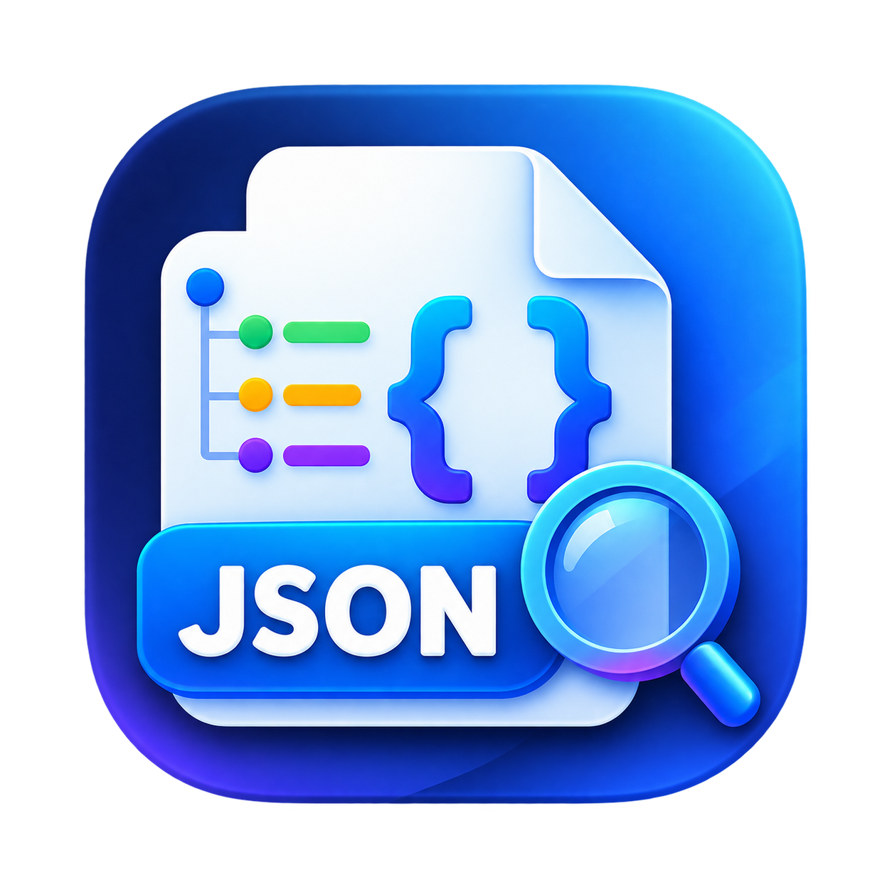

# EasyJSON

A fast, modern desktop JSON tool built with Electron + React + Vite.

## Features

- **JSON Editor** - Syntax highlighting, line numbers, code folding, auto-indent
- **JSON Tree View** - Expand/collapse nodes, search, inline editing
- **JSON Compare** - Side-by-side diff with synchronized scrolling
- **History Panel** - Save and manage multiple JSON documents
- **Dark Theme** - Modern minimalist developer tool aesthetic

## Screenshot



## Installation

### Download

Download the latest release from [GitHub Releases](../../releases).

### Build from Source

```bash
# Install dependencies
npm install

# Development
npm run dev

# Build for production
npm run build

# Build Windows installer
npm run electron:build
```

## Usage

1. **Paste JSON** - Paste JSON content into the editor
2. **Edit** - Edit JSON directly in the editor with syntax highlighting
3. **Tree View** - View JSON structure as a tree, expand/collapse nodes
4. **Compare** - Compare two JSON documents side by side
5. **History** - Save and switch between multiple JSON documents

## Keyboard Shortcuts

- `Ctrl+Z` - Undo
- `Ctrl+Y` - Redo
- `Ctrl+C` - Copy
- `Ctrl+V` - Paste

## Tech Stack

- **Electron** - Desktop application framework
- **React** - UI library
- **Vite** - Build tool
- **CodeMirror** - Code editor
- **CSS** - Styling (dark theme)

## License

MIT

## Contributing

Feel free to submit issues and pull requests.
